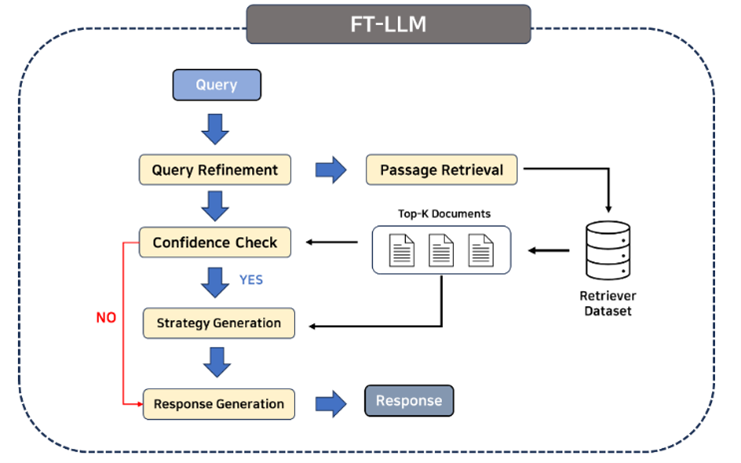

# FT-LLM: Development of a Retrieval Augmented Generation based Language Model Framework for Assisting Data Analysis in the Football Industry


FT-LLM: Development of a Retrieval Augmented Generation based Language Model Framework for Assisting Data Analysis in the Football Industry


## Architecture


## Authors

- [Seung Hun Han](https://www.github.com/SeungHunHan11)
- [Woo Hyun Hwang](https://github.com/rayhwang3130)
- [Minhyeok Kang](https://github.com/kangminhyeok02)


## Installation

### 1. Install Dockerfile 

```bash
    cd Docker
    docker build -t ftllm .
```

### 2. Build Container
```bash
docker run --gpus all -it -h ftllm \
        --ipc=host \
        --name ftllm \
        #--v local:container directory 
        ftllm bash
```

### 3. Inside the container, install requirements 

```bash
pip install -r requirements.txt
```
    
## Deployment

To deploy this project, do as the following steps

### Run ```run.py``` file

```bash
python run.py \
        --yaml_config ./config/runner_chatgpt.yaml \ # Configuration for hyperparameters
        --data_dir ./QA_dataset.csv \ # Data Directory for QA dataset
        --save_dir ./outputs/ # Set default directory for model outputs
```

- Inside yaml file, one should set relevant directory and hyperparameters accordingly

### Arguments

- Set OpenAI API Model type
    
     ```model_name```: str; options = [```gpt-3.5-turbo```,  ```gpt-4```]

- Set directory for Retrieval dataset

    ```data_dir```: str; default = ```"../json_data_new"```

- ```embedding_data_dir```: str; default = ```"../embedding_data"```

- Select type for retrieval module

    ```content_type```: str; options = ['All', 'title', 'content']
        
        "All" : Use both title and contents of the article
        "title" : Use title of the article
        "content" : Use content of the article
    
- Set number of articles that will be used for ```strategy generation``` module

    ```top_k```: int; default=3

- Set Directory for BM25 or Embedding model index file. If not set, index file will be automatically generated

    ```index_save_dir```: str; default= ```"./index_save_dir/sparse"```

- Set Retrieval Mode

    ```retrieve_mode```: 
        
        "sparse" : Use BM25
        "dense" : Use VectorDB

- Use ```Query Refinement Module``` or not

    ```use_refine```: str; options = ['unrefined', 'refined']

        "unrefied" : Do not use query refinement
        "refined" : Use query refinement


## Environment Variables

#### 1. Download retrieval dataset and necessary model weights
- To acquire retrieval dataset, contact andrewhan@korea.ac.kr

#### 2. Put OpenAI API Keys in ``` secret.py``` api_key
## Acknowledgements

 - [싸커러리 Soccerary](youtubrary@gmail.com) : QA Dataset Generation

## Feedback

If you have any feedback, please reach out to us at andrewhan@korea.ac.kr

